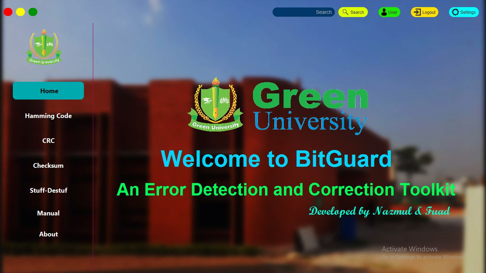
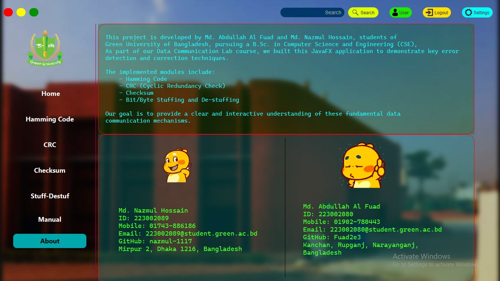

# BitGuard - an Error Detection and Correction Toolkit
The BitGuard is a various error detection and correction techniques. Take input from users and apply various error detection and correction technique based on users' selection.

## Overview
<!-- PROJECT SHIELDS -->
[![Contributors][contributors-shield]][contributors-url]
[![Forks][forks-shield]][forks-url]
[![Stargazers][stars-shield]][stars-url]
[![Issues][issues-shield]][issues-url]
[![Unlicense License][license-shield]][license-url]
[![X][x-shield]][x-url]

[//]: # (Version)
<!-- Another Version is start V2.0.1 -->

    

###

## About BitGuard
The BitGuard is a various error detection and correction techniques. The application will allow users to input data, apply different error detection and correction methods (including Hamming code, CRC, Checksum, and one other technique), simulate errors in the data, and observe how these techniques detect or correct those errors. The application will have a user-friendly interface, with clear input and output displays, and will provide a hands-on understanding of how these error detection and correction methods work.

  
  

(<a href="#readme-top">Back to Top</a>)

## Features
1. 
2. 
3. 
4. 
5. 
6. 
7. 

(<a href="#readme-top">Back to Top</a>)

## Tools and Technique

![JavaFX][java-shield]  
![CSS][css-shield]  
![github][github-shield]  
![github][xml-shield]  

(<a href="#readme-top">Back to Top</a>)

<!-- CONTRIBUTING -->
# Contributing

Contributions are what make the open source community such an amazing place to learn, inspire, and create. Any contributions you make are **greatly appreciated**.

If you have a suggestion that would make this better, please fork the repo and create a pull request. You can also simply open an issue with the tag "enhancement".
Don't forget to give the project a star! Thanks again!

1. Fork the Project
2. Create your Feature Branch (`git checkout -b feature/AmazingFeature`)
3. Commit your Changes (`git commit -m 'Add some AmazingFeature'`)
4. Push to the Branch (`git push origin feature/AmazingFeature`)
5. Open a Pull Request

### Top contributors:

(<a href="#readme-top">Back to Top</a>)

<!-- LICENSE -->
## License
Code and documentation copyright 2024-2025 the[`BitGuard-an-Error-Detection-and-Correction-Toolkit`][contributors-url] . Code released under the MIT License.

(<a href="#readme-top">Back to Top</a>)

<!-- CONTACT -->
# Contact
Md. Nazmul Hossain - [@nazmul_1117][x-url] - 223002089@student.green.ac.bd

Project Link: [BitGuard-an-Error-Detection-and-Correction-Toolkit][project-url]

(<a href="#readme-top">Back to Top</a>)

<!-- MARKDOWN LINKS & IMAGES -->

[//]: # (Shields)
[contributors-shield]: https://img.shields.io/github/contributors/nazmul-1117/BitGuard-an-Error-Detection-and-Correction-Toolkit?style=flat&for-the-badge&color=blue&labelColor=gray&logo=github

[forks-shield]: https://img.shields.io/github/forks/nazmul-1117/BitGuard-an-Error-Detection-and-Correction-Toolkit?style=flat&for-the-badge&color=red&labelColor=gray&logo=trailforks

[stars-shield]: https://img.shields.io/github/stars/nazmul-1117/BitGuard-an-Error-Detection-and-Correction-Toolkit?style=flat&for-the-badge&color=green&labelColor=gray&logo=asterisk

[issues-shield]: https://img.shields.io/github/issues/nazmul-1117/BitGuard-an-Error-Detection-and-Correction-Toolkit?style=flat&for-the-badge&color=cyan&labelColor=gray&logo=issuu

[license-shield]: https://img.shields.io/github/license/nazmul-1117/BitGuard-an-Error-Detection-and-Correction-Toolkit?style=flat&for-the-badge&color=ff4070&labelColor=gray&logoColor=ff4070&logo=unlicense

[x-shield]: https://img.shields.io/badge/X(Twitter)-@nazmul_1117-orange?logo=x&logoColor=blue

<!-- Markdown the Links -->
[project-url]: https://github.com/nazmul-1117/BitGuard-an-Error-Detection-and-Correction-Toolkit/

[contributors-url]: https://github.com/nazmul-1117/BitGuard-an-Error-Detection-and-Correction-Toolkit/graphs/contributors

[forks-url]: https://github.com/nazmul-1117/BitGuard-an-Error-Detection-and-Correction-Toolkit/forks

[stars-url]: https://github.com/nazmul-1117/BitGuard-an-Error-Detection-and-Correction-Toolkit/stargazers

[issues-url]: https://github.com/nazmul-1117/BitGuard-an-Error-Detection-and-Correction-Toolkit/issues

[license-url]: https://github.com/nazmul-1117/BitGuard-an-Error-Detection-and-Correction-Toolkit/blob/master/LICENSE.txt

[x-url]: https://x.com/nazmul_1117

[//]: # (Another Shield)
[github-shield]: https://img.shields.io/badge/GitHub-expert-e9301c?logo=github&logoColor=black
[java-shield]: https://img.shields.io/badge/Java-intermediate-004027?logo=jameson&logoColor=black
[xml-shield]: https://img.shields.io/badge/FXML-beginner-005FAD?logo=xml&logoColor=yellow
[css-shield]: https://img.shields.io/badge/css-beginner-yellow?logo=xml&logoColor=green